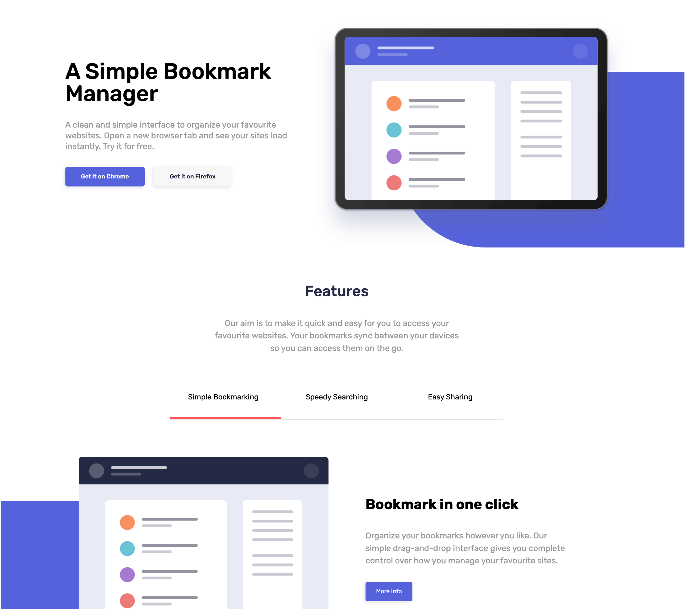

# Bookmark Landing Page

Made with plain JavaScript, HTML, and CSS, it complaits with almost all requirement of the chanllenge. 

## Overwiew
---

This is the solution to the [Bookmark landing page](https://www.frontendmentor.io/challenges/bookmark-landing-page-5d0b588a9edda32581d29158)

## The challenge
---
Users should be able to:

- View the optimal layout for the site depending on their device's screen size
- See hover states for all interactive elements on the page
- Receive an error message when the newsletter form is submitted if:
  - The input field is empty
  - The email address is not formatted correctly

## Built with
---
- Plain Javascript.
- HTML
- CSS

## Author
---
- My portfolio - [Leonel Matos](https://leonelmatos.com)
- Solution - [Bookmark Landing Page](https://leonelmatos.com/challenges/bookmark-landing-page)
- Frontend Mentor profile - [@leonelamatos](https://www.frontendmentor.io/profile/leonelamatos)

