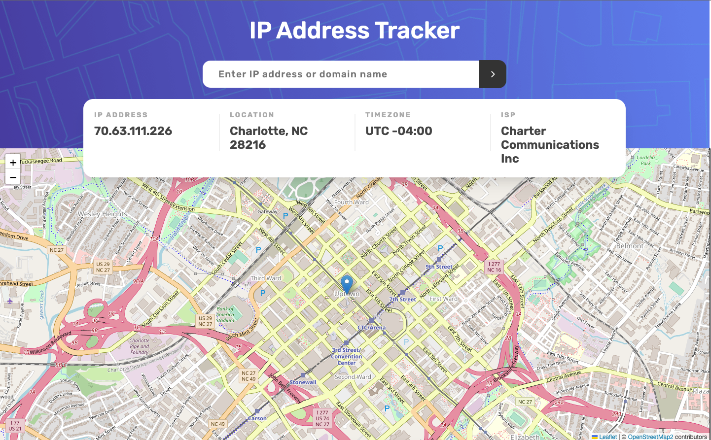

# Bookmark Landing Page

This application is built with NextJS, using CSS modules for the styling.

## Overwiew

This is the solution to the [IP Address Tracker](https://www.frontendmentor.io/challenges/ip-address-tracker-I8-0yYAH0)
coding challenge from [Frontend Mentor](https://www.frontendmentor.io/)

## The challenge

Your users should be able to:

-   View the optimal layout for each page depending on their device's screen size
-   See hover states for all interactive elements on the page
-   See their own IP Address on the map on the initial page load
-   Search for any IP addresses or domains and see the key information and location

## Built with

-   [NextJS](https://nextjs.org/).
-   [Ipwhois.io](https://ipwhois.io/) API - for the IP geolocation data.
-   [React Leaflet Map](https://react-leaflet.js.org/) - for the map.
-   CSS Module for styling.
- [React Context](https://reactjs.org/docs/context.html) - for sharing data between components.

## Author

-   My portfolio - [Leonel Matos](https://leonelmatos.com)
-   Solution - [IP Geolocation Tracker](https://apps.leonelmatos.com/challenges/ip-tracker)
-   Frontend Mentor profile - [@leonelamatos](https://www.frontendmentor.io/profile/leonelamatos)
